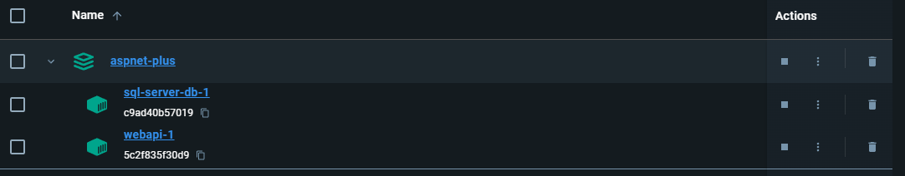
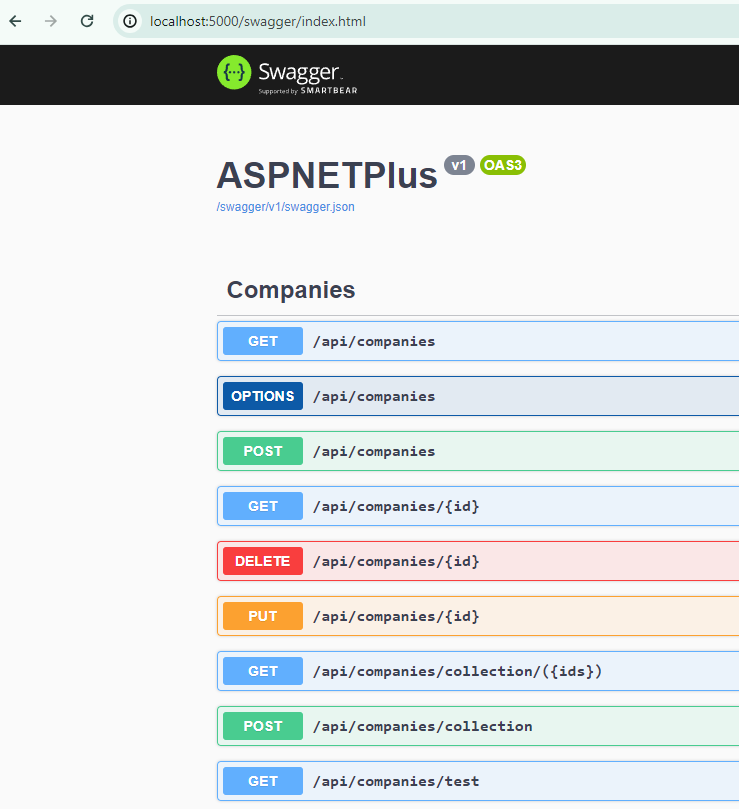

<div id="top"></div>

<div align="center">
  <a href="https://github.com/OxyProgrammer/aspnet-plus">
    
  </a>
  <br/>
  <h1 align="center"><u>ASPNet Plus</u></h1>

  <p align="center">
    Welcome to ASPNETPlus!
    <br/>
    <a href="https://github.com/OxyProgrammer/aspnet-plus/issues">Report Issue</a>
    ·
    <a href="https://github.com/OxyProgrammer/aspnet-plus/issues">Request Feature</a>
  </p>
  </div>

[](https://github.com/OxyProgrammer/aspnet-plus/issues)
[](https://github.com/OxyProgrammer/aspnet-plus/network)
[](https://github.com/OxyProgrammer/aspnet-plus/stargazers)
[](https://github.com/OxyProgrammer/aspnet-plus)

<!-- ABOUT THE PROJECT -->

## About The Project

This repository contains a comprehensive ASP.NET Core Web API project showcasing following features of ASP.NET Core with .NET 8.

#### Onion Architecture

<p align="center">
  
</p>

Organized using Onion architecture principles to maintain modularity and separation of concerns. ASPNETPlus has separate Domain, Service, Presentation and infrastructure layers. The Outer layers can make use of inner layers but inner layers won't be aware of the outer layers.
[This](https://medium.com/expedia-group-tech/onion-architecture-deed8a554423) is a very good starting point, if you wish to learn more about Onion architecture.

#### Logging using NLog

<p align="center">
  
</p>

[NLog](https://nlog-project.org/documentation/) is a powerful logging framework that provides extensive logging capabilities for ASP.NET Web API applications. With NLog, developers can easily configure and manage logging levels, targets, and formats, allowing for comprehensive monitoring and analysis of application behavior. It offers flexibility in logging to various targets such as files, databases, and cloud services, making it a versatile choice for logging needs in ASP.NET Web API projects.
ASPNETPlus displays detailed setup and configuration of NLog for logging in ASP.NET Core.

#### Filters

ASP.NET filters are attributes that inject logic into the request pipeline, enabling global or selective application of cross-cutting concerns like authorization and validation in ASP.NET applications.

#### Error Handling Best Practices

Exception handling in ASP.Net, conventionally has been dine using middleware. However with .Net 8, a more powerful way of exception handling is : [IExceptionHandler](https://learn.microsoft.com/en-us/dotnet/api/microsoft.aspnetcore.diagnostics.iexceptionhandler?view=aspnetcore-8.0). ASPNETPlus showcases both ways.

#### Content Negotiation

Content Negotiation in ASP.NET Core refers to the process of determining the most suitable content format (JSON, XML, etc.) to send in response to client requests based on the request headers. It allows APIs to provide data in different formats, enhancing interoperability and flexibility for clients consuming the API.
ASPNETPlus showcases content negotiation for JSON, XML, and even custom format.

#### Bulk Creation of Resources

Shows implementation of bulk creation endpoints using [Custom ModelBinder](https://learn.microsoft.com/en-us/aspnet/core/mvc/advanced/custom-model-binding?view=aspnetcore-8.0).

#### Validation

Shows the various ways of request input validation using built-in ASP.NET Core features, including filters.

#### Handling Parent-Child Relations

Shows strategies for handling entities with parent-child relations.

#### HTTP Actions

Shows implementation of standard HTTP actions like GET, POST, PUT, DELETE, OPTIONS, HEAD.

#### Advanced Data Handling

Features filtering, paging, searching, sorting, and data shaping to minimize network bandwidth.

#### Rate Limiting and Throttling

Implementation of rate limiting and throttling for API endpoints.

#### Versioning

API versioning to support backward compatibility.

#### Documentation using Swagger

Integration with Swagger for API documentation.

<p align="right">(<a href="#top">back to top</a>)</p>

## Setup

The code can be run using either Docker Desktop or conventionally on your local machine using Visual Studio. The API use MS SQL aatabase and if you are going to run the code locally, you will need to have MS SQL Developer edition running on your machine.
You may would like to install MS SQL Database Developer Edition from  [MS SQL Server downloads page](https://www.microsoft.com/en-us/sql-server/sql-server-downloads).

The database, tables and initial data seeding is automaticall done by the web api code during its firt time run. Please note the connection string are already present in the appsettings.json files:
+ For Docker Desktop: [appsettings.Production.json](https://github.com/OxyProgrammer/aspnet-plus/blob/main/ASPNETPlus/appsettings.Production.json)
+ For local build: [appsettings.Development.json](https://github.com/OxyProgrammer/aspnet-plus/blob/main/ASPNETPlus/appsettings.Development.json)

For local environment, if you are facing db connection errors (especially named pipe error), I strongly suggest you to try basic trouble shooting using [this video](https://www.youtube.com/watch?v=rLL3LEIj2jM). If still you aren't able to get the db connection working, [do give a shout here](https://github.com/OxyProgrammer/aspnet-plus/issues), I will do the best to help you!

### Docker Desktop

This is not microservices, however if you don't wish to install MS SQL on your local machine and still want to run and test the WebAPI; using docker desktop is the best option you got. To run this project using Docker Desktop, follow these steps:

- Clone the repository to your local machine:

  ```
  git clone https://github.com/oxyprogrammer/ASPNETPlus.git
  ```

- Navigate to the project directory:

  ```
  cd ASPNETPlus
  ```

- Build the required Docker images:

  ```
  docker-compose build
  ```

  This may take some time for the first time as it will pull MS SQL image and also build the entire web api project into a docker Image. If you inspect the docker Image of the WebAPI, you may be curious to find the default port is 8080 (unlike 80, as you may have expected). [This is a change since .NET 8.0](https://learn.microsoft.com/en-us/dotnet/core/compatibility/containers/8.0/aspnet-port).

- Run the Docker compose

  ```
  docker-compose up -d
  ```

  You should be able to see the two containers (MS SQL Database and WebAPI) up in Docker Desktop:

  <p align="center">
    
  </p>

  Additionally, you should be able to access

  ```
  http://localhost:5000/swagger/index.html:
  ```

  <p align="center">
    
  </p>

- Access the API using your web browser (with Swagger) or use a tool like Postman.

<p align="right">(<a href="#top">back to top</a>)</p>

### Visual Studio and MS SQL Database

To run this project using Visual Studio and MS SQL Database, follow these steps:

- Clone the repository to your local machine:

  ```bash
  git clone https://github.com/oxyprogrammer/ASPNETPlus.git

  ```

- Open the solution in Visual Studio.

- Build and run the project using Visual Studio.

- Access the API using your web browser or a tool like Postman:

  ```
  http://localhost:5000/swagger

  ```

<p align="right">(<a href="#top">back to top</a>)</p>

### Usage

Once the project is up and running, you can interact with the API endpoints to test the features showcased in this project. Here are some example requests:

<!-- Provide examples of API requests and responses -->

## Contributing

Contributions are welcome! If you'd like to contribute to this project, please follow these steps:

- Fork the repository.
- Create a new branch for your feature or bug fix.
- Make your changes.
- Test your changes thoroughly.
- Commit your changes with descriptive commit messages.
- Push your changes to your fork.
- Submit a pull request to the main repository's main branch.
- License
- This project is licensed under the MIT License.

<p align="right">(<a href="#top">back to top</a>)</p>

## Acknowledgements

- [ASP.NET Core](https://learn.microsoft.com/en-us/aspnet/core/web-api/?view=aspnetcore-8.0)
- [NLog](https://nlog-project.org/documentation/)
- [Swagger](https://learn.microsoft.com/en-us/aspnet/core/tutorials/web-api-help-pages-using-swagger?view=aspnetcore-8.0)

<p align="right">(<a href="#top">back to top</a>)</p>

## Contact

If you have any questions, suggestions, or issues, please feel free to contact the project maintainer:

OxyProgrammer - oxyprogrammer@gmail.com

Project Link: [https://github.com/OxyProgrammer/aspnet-plus](https://github.com/OxyProgrammer/aspnet-plus)

<p align="right">(<a href="#top">back to top</a>)</p>
